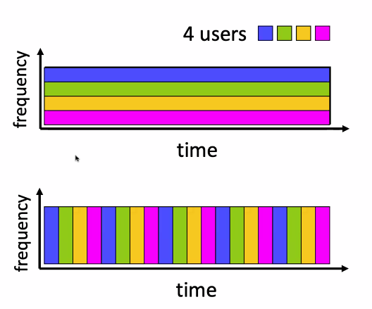

# Lecture 2

## Links: Physical Media
### Wireless media
- Signal carried in EM spectrum
  - no physical wire
  - broadcast and "half-duplex"
  - propagation environment effects:
    - reflection
    - obstruction
    - interference
- Radio link types
  - terrestrial microwave
    - up to 45 mbps channels
  - Wireless LAN 
    - up to 100s of mbps
  - wide-area (cellular)
    - 4g cellular ~10mbps
  - satellite
    - up to 45 Mbps
    - 270 msec end-end delay 
    - geosynchronous versus low-earth-orbit
      - geosynchronous rotates around earth same speed as earth
        - keeps same place all the time
        - very far from earth
      - LEO
        - closer 
        - needs to go very fast 

# Network Core
## Forwarding
- Local action
  - move arriving packets from router's input link to appropriate router output link 
- When packet arrives, depending on destination address
  - lookup destination edges in local forwarding table 
  - forwards to the right output link 
## Routing
- Global action
- determine source-destination paths taken by packets
- routing algorithms 
## Circuit Switching
- end-end resources allocated to, reserved for "call" between source and destination 
- dedicated resources: no sharing
  - circuit-like (guaranteed ) 
  - commonly used in traditional telephone networks 
### FDM and TDM
- Frequency Division Multiplexing
  - optical, electromagnetic frequencies divided into narrow frequency bands
  - each call allocated its own band, can transmit at max rate of that narrow band
- Time Division Multiplexing
  - time divided into slots
  - each call allocated periodic slots, can transmit at maximum rate of frequency band, but only during its time slot
  - 
## Packet switching vs Circuit switching
- Packet switching has been dominant
  - allows more users to use network
    - 1gbps link 
    - each user:
      - 100mbps 
      - active 10% of time
  - if you use circuit switching, max 10 users
  - packet switching you can give to 35 users with probability >10 active users is less than .0004% 
    - how to calculate .0004?
      - let x be the number of users active at a certain time
      - then x is a random variable with a binomial distribution: Binom(35, .1)
      - so Pr[x=i] = (35 choose i) * .1^i * .9^(35-i) 
      - Pr[x>10] = Pr[X=11] + ... Pr[X=35]
- Is packet switching always better?
  - not necessarily 
  - great for bursty data, sometimes has data to send, but at other times not
    - resource sharing
    - simpler, no call setup
  - Excessive congestion possible: packet delay and loss due to buffer overflow
    - protocols needed for reliable data transfer, congestion control
  - How to provide circuit-like behavior?
    - bandwidth guarantees traditionally used for audio/video applications
  - Human analogies of reserved resources versus on demand allocation 

# Internet structure: a "network of networks"
- Hosts connect to internet via access internet service providers
  - residential, enterprise
- access ISPs in turn must be interconnected
  - so that any two hosts can send packets to each other
- resulting network of networks is very complex

## How to connect them together?
- One way is to put a wire between every access ISP
  - not realistic 
  - O(n^2) connections
- Another way is to use global isp and connect all access isps to them
  - if only one global isp, then they make a lot of money, so there is competition
  - multiple global ISPs 
  - need to be connected to each other either directly or indirectly
    - directly via IXP - Internet Exchange Points
  - alternatively can use peering links
    - agreement where they dont pay each other but send data anyway
  - Regional ISPs
    - access ISPs connect to regional ISPs because global don't want to connect everything
  - Content provider networks
    - facebook or google
    - resources scattered along big ISPs 
    - puts content into these networks so that the content can be displayed with lower latency 

### structure
- at center: number of small well connected large networks
  - tier 1 isps with national and international coverage
  - content provider networks 
- Point of presence is a node on the graph 
  - PoP have big routers 
    - big routers connect to other networks 
    - example, sprint PoP has connection to verizon and ATT
    - also connection to other PoPs
    - also connection to local customers

# Performance metrics 

## How do packet loss and delay occur?
- Packets queue in router buffers
  - packets queue, wait for turn
  - arrival rate to link exceeds link capacity: packet loss
  - packets being transmitted (transmission delay)
  - packets in buffers (queueing delays )
- Packet delay has 4 components
  - processing delay
    - when a packet fully arrives, router has to lookup table and compare with header 
  - queue
    - waiting for its turn to send
  - transmission delay
    - time to transmit
  - propagation delay
    - length of wire divided by speed of light or speed of electricity propagating in the wire 