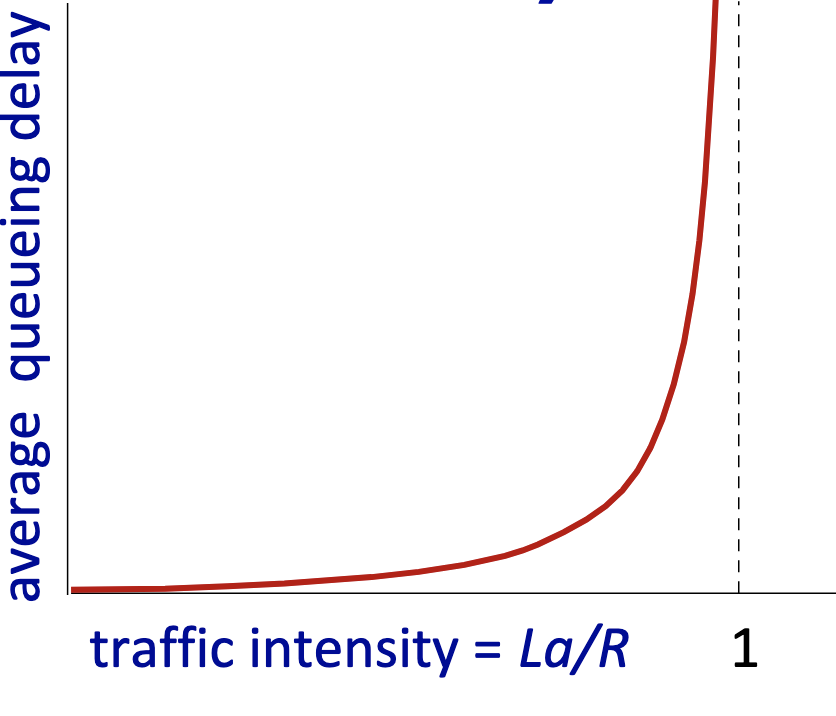
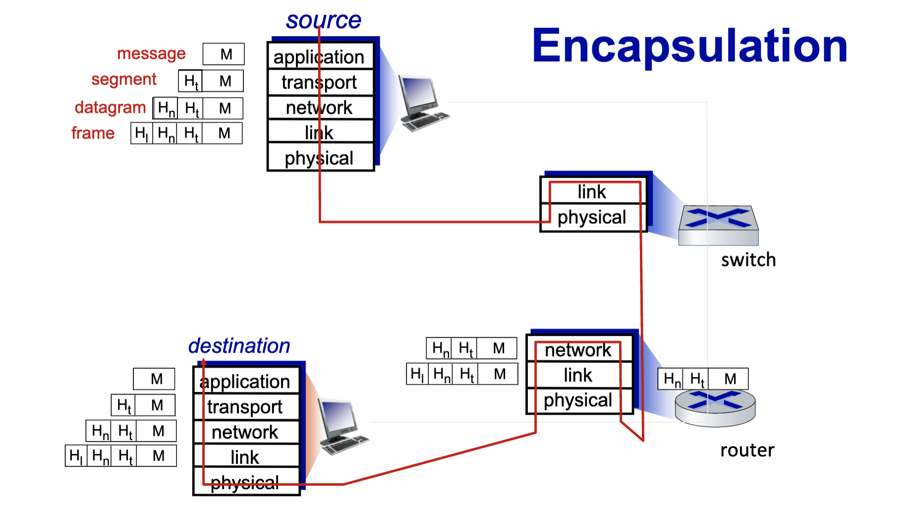

# Lecture 3

- Transmission delay 
  - L: packet Length
  - R: link transmission rate
  - Dtrans = L/R
- Propagation Delay
  - d: length of physical link
  - s: propagation speed (~2e8m/sec)
  - dprop = d/s
- Caravan analogy
  - caravan is packet
  - cars propagate at 100km/hr
  - toll booth takes 12 seconds to service car (bit transmission time)
  - car ~bit; caravan ~ packet
  - 100km between each toll booth
  - Q: how long until caravan is lined up before 2nd toll booth
    - number of cars over time for each car plus
    - length of road divided by speed: time for last car to propagate
- Packet queuing delay
  - R: link bandwidth
  - L: packet length
  - a: average packet arrival rate 
  - La/R ~ 0 avg queuing delay small
  - La/R -> 1: avg queueing delay large
  - La/R > 1: more "work" arriving is more than can be serviced - average delay infinite
  - 
## Real internet delays and routes
- what do "real" internet delay and loss look like?
- traceroute program: provides delay measurement from source to router along end-end internet path towards destination. For all i
  - sends three packets that will reach router i on path towards destination (with time-to-live field value of i) 
  - router i will return packets to sender
  - sender measures time interval between transmission and reply 
  - routers do not have to participate in the traceroute
## Packet Loss
- queue preceding link in buffer has finite capacity
- packet loss occurs when the queue is full and packets arrive
  - dropping packets
- lost packet may be retransmitted by previous node, by source end system, or not at all
- throughput
  - rate (bits/time) at which bits are being sent from sender to receiver
  - instantaneous: rate at given point in time
  - average: rate over longer period of time
  - end to end rate is always bottlenecked by the smaller constraint 
  - if R_s < R_c then the average is the smaller one 
## Protocol "layers" and reference models
- Networks are complex with many pieces:
  - hosts
  - routers
  - links of various media
  - applications
  - protocols
  - hardware, software
- Question: is there any hope of organizing structure of network
- layers:
  - each layer implements a service
    - via its own internal layer actions
    - relying on services provided by the layer below
  - Why layering?
    - dealing with complex systems
    - explicit structure allows identification, relationship of complex system’s pieces
      - layered reference model for discussion
    - modularization eases maintenance, updating of system
      - change in layer's service implementation: transparent to rest of system
        - e.g., change in gate procedure doesn’t affect rest of system
    - layering considered harmful?
    - layering in other complex systems?
# Internet protocol stack
- application
  - supporting network applications 
    - IMAP, SMTP, HTTP
- transport: 
  - process-process data transfer
    - TCP, UDP
- network:
  - routing of datagrams from Source to destination
    - IP, routing protocols
- link: 
  - data transfer between neighboring network elements
    - Ethernet, 802.11, PPP
- physical: 
  - bits "on the wire"
- 

# Chapter 2 Application Layer
- Overview
  - principles of network applications
  - web and HTTP
  - Email, SMTP, IMAP
  - The Domain Name System
    - DNS
  - P2P applications
  - video streaming and content distribution networks
  - socket programming with UDP and TCP
## Creating a network app
- write a program that:
  - runs on different end systems
  - communicate over network
  - web server sortware communicates with browser software
- No need to write software for network-core devices
  - network-core devices do not run user applications
  - applications on end systems allow for rapid app development, propagation
## Sockets
- Process sens./ receives messages to/from its socket
- socket analogous to door
  - sending process shoves message out door
  - sending process relies on transport infrastructure on other side of door to deliver message to socket at receiving process
  - two sockets involved: one on each side 
## Addressing Processes
- to receive messages, process must have identifier
- host device has unique 32 bit ip address
- Q: does IP address of host on which process runs suffice for identifying the process
- A: no many processes can be running on same host
- identifier includes both IP address and port nu
