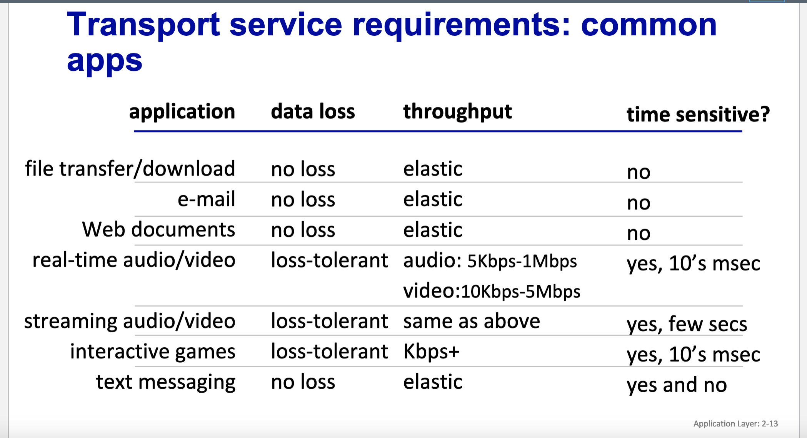
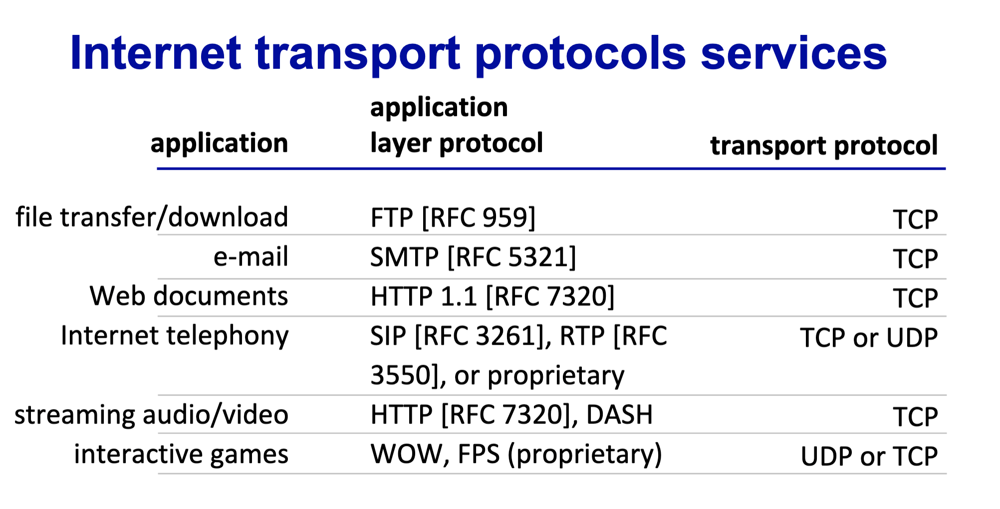
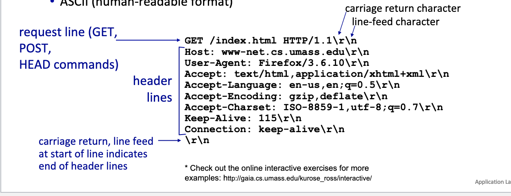
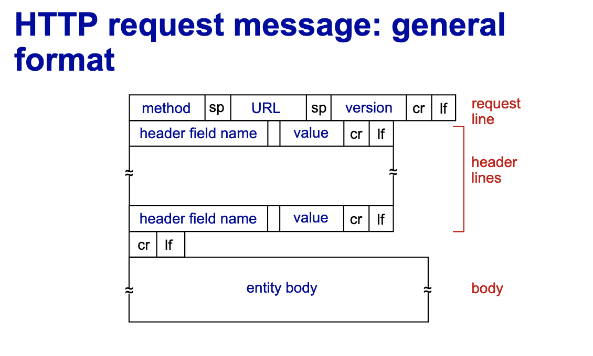

# L4 

# An application layer protocol defines: 
- Types of messages exchanged
- message syntax
- message semantics
- rules for when and how processes send and respond to messages
- Open protocols 
- proprietary protocols 

# What transport service does an app need?
- Data integrity
  - some apps (e.g. file transfer, web transactions) require 100% reliable data transfer
  - other apps (audio) can tolerate some loss
- Timing
  - some apps (internet telephony, interactive games) require low delay
- throughput
  - some (multimedia) require some minimum amount of throughput to be "effective"
  - other apps ("elastic apps") make use of whatever throughput of whatever throughput they get 
- security
  - encryption, data integrity 
-

# Internet transport protocol services
- TCP service
  - reliable transport between sending and receiving process
  - flow control: sender wont overwhelm receiver
  - congestion control: throttle sender when network overloaded
  - does not provide: timing, minimum throughput guarantee, security
  - connection-oriented: setup required between client and server processes
  - a lot of operating system overhead 
- UDP 
  - unreliable data transfer between sending and receiving process
  - does not provide: reliability, flow control, congestion control, timing, throughput guarantee, security, or connection setup
  - lightweight 
  - for simple processes you don't need TCP so you can use UDP 
- 
# Securing TCP 
- Vanilla TCP and UDP sockets:
  - no encryption
  - cleartext passwords sent into socket travers internet in cleartext
- Transport Layer Secuirty (TLS)
  - provides encrypted TCP connections
  - data integrity
  - end-point authentication
- TLS implemented in application layer
  - apps use TSL libraries that use TCP in turn
- TLS socket API
  - cleartext sent into socket travers internet encrypted 

# Web and HTTP
- quick review
  - web page consists of objects, each of which can be stored on different Web servers
  - objects can be HTML file, JPEG image, Java applet, audio file, ....
  - web page consistss of base HTML file which includes several referenced objects, each addressable by a URL
# HTTP 
- Hypertext transfer protocol
  - web's application layer protocol 
  - client/server model:
    - client: broser that requests, receives and displays web objects
    - server: web server sends objects in response to requests
- HTTP uses TCP:
  - client initiates TCP connection (creates socket) to server, port 80 
  - server accepts TCP connection from client
  - HTTP messages (application-layer protocol messages) exchanged between browser (HTTP client) and web server
  - TCP connection closed
- HTTP is "stateless"
  - server maintains no information about past client requests

# HTTP connections: 2 types
- non persistent 
  - TCP connection opened 
  - at most one object sent over TCP connection
  - TCP connection closed 
  - downloading multiple objects required multiple connections 
- persistent
  - TCP connection opened to a server 
  - multiple objects can be sent over single TCP connection between client and that server
  - TCP connection closed

# Non-persistent HTTP: example
  - HTTP Client initiates TCP connection to HTTP server
    - HTTP server at host waiting for TCP connection at port 80 accepts connection, notifying client
  - HTTP client sends HTTP request message containing URL into TCP connection socket. Message indicates that client wants object
    - HTTP server receives request message, forms response message containing requested object, and sends message into its socket 
  - HTTP server closes TCP connection
    - HTTP client receives response message containing html file, displays html, parsing html file, finds 10 referenced jpeg objects
  - earlier steps repeat for each JPEG 

# Non persistent HTTP: response time
- RTT: time for a small packet to travel from client to server and back
- HTTP response time (per object):
  - one RTT to initiate TCP connection
  - one RTT for HTTP request and first frew bytes of HTTP response to return 
  - object/file transmission time 

# persistent HTTP 
- Non persistent HTTP issues:
  - require 2 RTTs per object
  - OS overhead for each TCP connection 
  - browsers often open multiple parallel TCP connections to fetch referenced objects in parallel
- Persistent HTTP
  - server leaves connection open after sending response
  - subsequent HTTP messages between same client/server sent over open connection 
  - client sends requests as soon as it encounters a referenced object 
  - as little as one RTT for all the referenced objects 
# HTTP request message
- two types of HTTP messages: request, response
- HTTP request message 
  - ascii (human readable format)- 
  - 

# Other HTTP request messages
- POST method:
  - web page often includes form input
  - user input sent from client to server in entitity body of HTTP POST request
- GET method (for sending data to server):
  - include user data in URL field of HTTP GET request message (following a '?')
- HEAD method:
  - requests headers (only) that qould be returned if specified URL were requested with an HTTP GET method 
- PUT method
  - uploads new file to server
  - completely replaces file that exists at specified URL with content in entity of PUT HTTP request message

# HTTP response status codes
- status code appears in 1st line in server-to-client response message
  - 200 OK
    - request succeeded, requested object later in this message
  - 301 moved permanently 
    - requested object moved, new location specified later in this message
  - 400 bad request
    - request msg no understood by server
  - 404 not found
    - requested document not found on this server
  - 505 HTTP version not supported 

# Maintaining user/server state: cookies
- recall: HTTP GET/response interaction is stateless
- no notion of multi-step exchanges of HTTP messages to complete a web transaction
  - no need for client.server to track "state" of multi-step exchange
  - all HTTP requests are independent of each other 
  - no need for client/server to "recover" from a partially-completed-but-never-completely-completed transaction 

# Maintaining user/server state: cookies
- web sites and client browser use cookies to maintain some state between transactions
- four components:
  - cookie header line of HTTP response message
  - cookie header line in next HTTP request message
  - cookie file kept on user's host, managed by user's browser
  - back-end database at web site
- example:
  - Susan uses browser on laptop, 
visits specific e-commerce site 
for first time
    - when initial HTTP requests 
arrives at site, site creates: 
      - unique ID (aka “cookie”)
      - entry in backend database for ID
      - subsequent HTTP requests from Susan to this site will contain cookie ID value, allowing site to “identify” Susan

# HTTP cookies: comments
- what cookies can be used for:
  - authorization
  - shopping carts
  - recommendations
  - user session state
- Challenge: how to keep state:
  - protocol endpoints: maintain state at sender/receiver over multiple transactions
  - cookies: HTTP messages carry state
# Web caches (proxy servers)
- Goal: satisfy client request without involving origin server
- user configures browser to point to a web cache
- browser sends all HTTP requests to cache
  - if object in cache: cache returns object to client
  - else cache requests object from origin server, caches received object, then returns object to client
- web cache acts as both client and server
  - server for original requesting client
  - client to origin server
- typically cache is installed by ISP (university, company, residential ISP)
- why???????
  - reduce response time for client request
    - cache is closer to client
  - reduce traffic on an institutions access link
  - internet is dense with caches 
    - enables "poor" content providers to more effectively deliver content 

# Caching example
- Scenario:
  - access link rate: 1.54 Mbps
  - RTT from institutional router to server: 2 sec
  - Web object size: 100k bits
  - Average request rate from browsers to origin servers: 15/sec
    - average data rate to browsers: 1.5 MBps
- Performance:
  - Lan utilization: .0015
  - access link utilization = .97 
  - end-end delay = internet delay + access link delay + LAN delay
  - = 2 sec + minutes + usecs 
- 