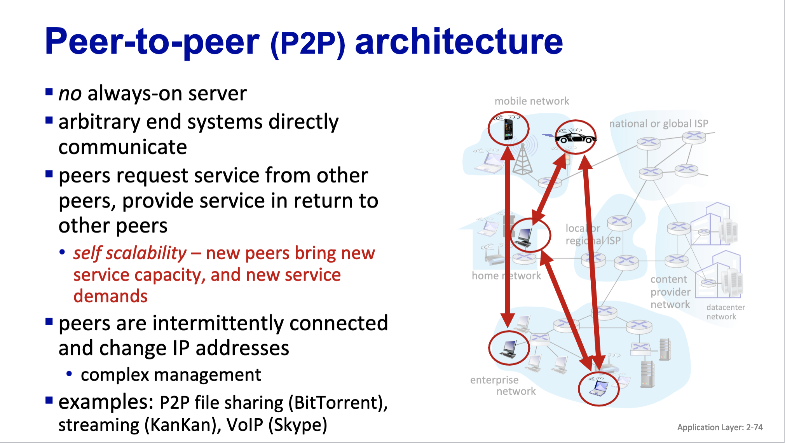
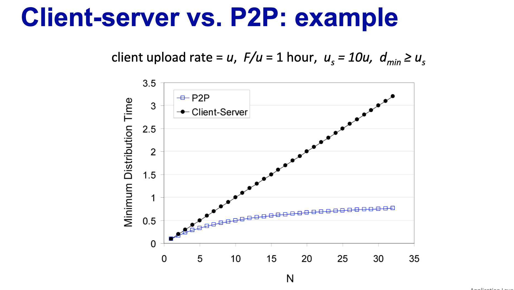
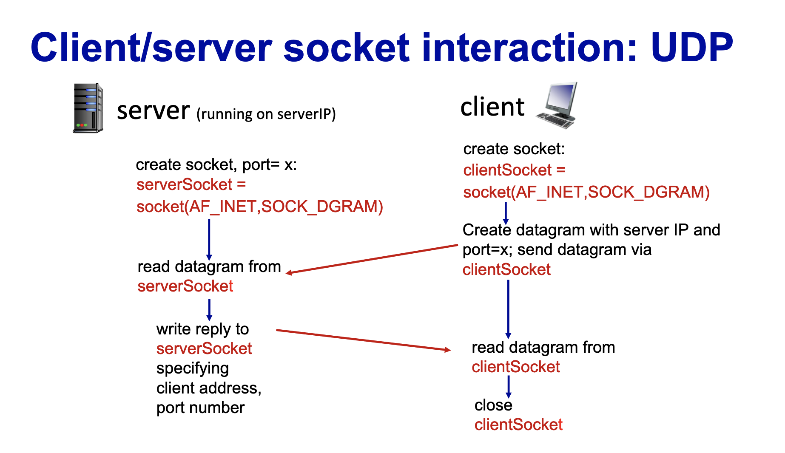

# Lecture 6

# File distribution: client-server vs P2P
- How much time to distribute file (size F) from one server to N peers
  - peer upload/download capacity is limited resource

# File distribution time: client-server
- server transmission: must sequentially send (upload) N file copies:
  - time to send one copy: F/us
  - time to send N copies: NF/us
- client: each client must download file copy
  - d_min = min client download rate
  - min client download time: F/dmin
- time to distribute F to N clients using client server approach = Dcs-s >= max(NF/Us, F/dmin)

# File distribution time: P2P
- server transmission must upload at least one copy 
  - time to send one copy: F/us
- client: each client must download file copy 
  - min client download time: F/dmin
- clients: as aggregate must download NF bits
  - max upload rate (limiting max download rate) is us + sigma ui
- DP2P > max(F/us, F/dmin, NF/(us + sigmaui))

# client server vs P2P: exampls

- P2P is much more scalable

# P2P file distribution: BitTorrent
- file divided into 256Kb chinks
- peers in torrent send/receive file chunks
  - tracker tracks peers participating in torrent
    - only tracks who is in the system not who has what chunk
  - torrent: group of peers exchanging chunks of a file 
  - if someone arrives, obtains list of peers from tracker and begins exchangiong chunks with the torrent

- peer joining torrent: has no chunks, but will accumulate them over time from other peers
- registers with tracker to get list of peers, connects to subset of peers ("neighbors") not all peers
- while downloading, peer uploads chunks to other peers
- peer may change e=peers with whom it exchanges chunks
- **churn: peers may come and go**
- once peer has entire file, it may (selfishly) leave or (altruistically) remain in torrent

# BitTorrent: requesting, sending file chunks
- requesting chunks:
  - at any given time, different peers have different subsets of file chunks
  - periodically, alice asks each peer for list of chunks that they have
  - alice requests missing chunks from peers, rarest first
- sending chunks: tit-for-tat
  - alice sends chunks to those four peers currently sending her chunks at highest rate
    - other peers are choked by alice (do not receive chunks from her)
    - re-evaluate top 4 every 10 seconds
  - every 30 secs: randomly select another peer, starts sending chunks
    - "optiistically unchoke" this peer
    - newly chosen peer may join top 4

# BitTorrent: tit-for-tat
- Alice optimisticallly unchokes bob
- alice becomes obe of bob's top 4 providers, bob reciprocates
- bob becomes one of alice's top 4 providers 
- higher upload rate: find better trading partners, get file faster 

# Socket programming
- goal: learn how to build client/server applications that communicate using sockets
- socket: door between application process and end-end-transport protocol 
- two socket types for two transport services:
  - UDP unreliable datagram
  - TCP: reliable, byte stream-oriented
- Application example:
  - client reads a line of characters from its keyboard and sends data to server
  - server receives the data and converts characters to uppercase
  - server sends modified data to client
  - client receives modified data and siplays line on its screen

# Socket programming with UDP
- UDP: no "connection" between client and server
  - no handshaking before sending data
  - sender explicitly attaches IP destination addresss and port # to each packet
  - receiver extracts sender IP address and port # from received packet
- UDP: transmitted data may be lost or received out of order
- Application viewpoint
  - UDP provides unreliable transfer of groups of bytes between client and server 

# Client server socket interaction: UDP
- 
- client closes socket after every interaction

# Socket programming with TCP
- Client must contact server
  - server process must first be running
  - server must have created socket that welcomes client's contact
- client contacts server by: 
  - creating TCP socket, specifying IP address, port number of server process
  - when client creates socket: client TCP establishes connection to server 
- when contacted by client, server TCP creates new socket for server process to communicate with that particular client
  - allows server to talk with multiple clients
  - source port number used to distinguish clients 

# Transport layer 
## Transport services and protocols
- provide logical communication between application processes running on different hosts
- transport protocols action in end systems:
  - sender breaks application messages into segments, passes to network layer
  - receiver reassembles segments into messages, passes to application layer
- two transport protocols
  - TCP, UDP

## Transport vs network layer services and protocols
- network layer, logical communication between hosts
- transport layer, logcial communication between processes 
  - relies on enhences, network layer services 
- sender
  - passed an application layer message
  - determines segment header field values 
  - creates segments 
  - passes segment to IP
- reveiver 
  - receives segment from IP
  - checks header value 
  - extracts application layer messages 
  - demultiplexes message up to application via socket
## Two principal internet transport protocols
- TCP: 
  - transmission control protocol
  - reliable, in order delivery 
  - congestion control 
  - flow control 
  - connection setup
- UDP 
  - User datagram protocol 
  - unreliable, unordered delivery 
  - no-frill 
- services not available
  - delay guarantees
  - bandwidth guarantees 
  
  
## Multiplexing/demultiplexing 
- multiplexing at sender 
  - hande data from multiple sockets, add transport header (later used for demultiplexing)
- demultiplexing at receiver 