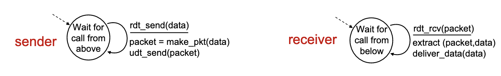
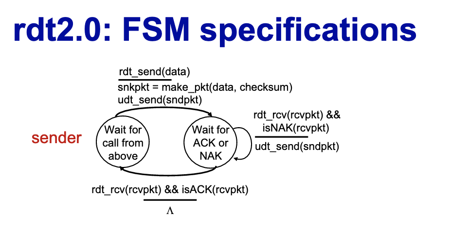
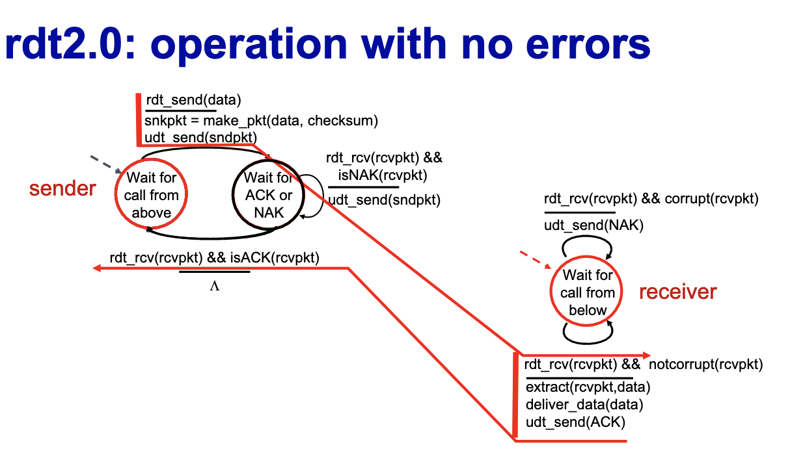
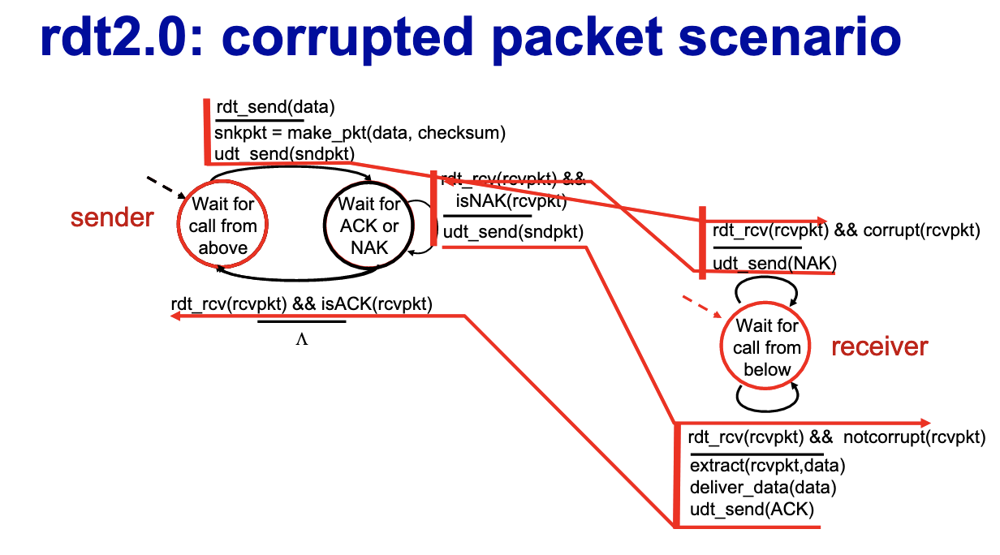

# L7 

## Multiplexing/Demultiplexing
## How demultiplexing works
- host receives IP datagrams
  - each datagram has source IP address, destination IP addresss
  - each datagram carries one transport layer segment
  - each segment has source, destination port number
- host uses IP addresses and port numbers to direct segment to appropriate socket 

## Connectionless demultiplexing
- recall 
  - when creating socket must specify host-local port #
  - when creating datagrams to send into UDP socket, must specify 
    - destination IP address
    - destination port # 
- when receiving host receives UDP segment: 
  - checks destination port # in segment
  - directs UDP segment to socket with that port # 
- IP/UDP datagrams with same dest port # but different source IP addresses and or source port numbers will be directed to same socket at receiving host

## Connection oriented demultiplexing 
- TCP socket identified by 4-tuple
  - source IP address
  - source port number
  - dest IP address
  - dest port number
- demux: receiver uses all four values to direct segment to appropriate socket 
- server may support many simultaneous TCP sockets
  - each socket identified by its own 4-tuple
  - each socket associated with different connecting client 

# summary
- multiplexing, demultiplexing: based on segment, datagram header field values
- UDP: demultiplexing using destination port number only 
- TCP: demultiplexing using 4-tuple: source and destination IP 
addresses, and port numbers
- Multiplexing/demultiplexing happen at all layers

# UDP User datagram protocol
- no frills, bare bones
- best effort service
  - UDP segments may be lost or delivered out of order to app
- conncetionless:
  - no handshaking between UDP sender, receiver
  - each UDP segment handled independently of others
- Why UDP:
  - no connection establishment which can add RTT Delay
  - simple, no connection state at sender, receiver
  - small header size
  - no congestion control
    - UDP can blast away as fast as desired
    - can function in the face of congestion 
- UDP uses:
  - streaming multimedia app (loss tolerant, rate sensitive)
  - DNS
  - SNMP
  - HTTP/3
- if reliable transfer needed over UDP
  - add needed reliability at application layer
  - add congestion control at application layer

## UDP: trasnport layer actions
- UDP sender actions:
  - is passed an application-layer message
  - determines UDP segment header fields values
  - creates UDP segment
  - passes segment to IP 
- UDP receiver actions:
  - receives segment from IP 
  - checks UDP checksum header value
  - extracts application layer message
  - demultiplexes message up to application via socket 
## UDP segment header
- source port # 2 bytes
- dest port # 2 bytes
- length - in bytes of UDP segment including header - 2 bytes
- checksum - 2 bytes
## UDP checksum 
- goal detect errors (i.e. flipped bits) in transmitted segment 
- internet checksum
- sender:
  - treat contents of UDP segment (including UDP header fields and IP addresses) as sequence of 16 bit integers
  - checksum: addition (one's complement sum) of segment content
  - checksum value put into UDP checksum field
- receiver:
  - compute checksum of received segment 
  - check if computed checksum equals checksum field value
    - not equal - error detected - just throw away the packet if it is wrong
    - equal - no error detected, but maybe error 

## Summary 
- no frills protocol
  - segments may be lost, delivered out of order
  - best effort service: "send and hope for the best"
- UDP plusses
  - no setup/handshaking
  - can function when network service is compromised
  - helps with reliability (checksum)
- build additional functionality on top of UDP in application layer

# Principles of reliable data transfer
- complexity of reliable data transfer protocol will depend (strongly) on characteristics of unreliable channel (lose, corrupt, reorder data)
- sender, receiver do not know the state of each other (e.g. was a message received)
  - unless communicated via a message
- rdt_send(): called from above (e.g. by app) passed data to deliver to receiver upper layer
  - sender-side implementation of rdt reliable data transfer protocol
- udt_send(): called by rdt to transfer packet over unreliable channel to receiver 
- bi directional communication over unreliable channel
- rdt_rcv() called when packet arrives on receiver side of channel
  - receiver side implementation of rdt reliable data transfer protocol
- deliver_data() called by rdt to deliver data to upper layer

## Reliable data transfer: getting started
- we will:
  - incrementally develop sender, receiver sides of reliable data transfer protocol (rdt)
  - consider only unidirectional data transfer
    - but control info will flow in both directions
  - use finite state machines (FSM) to specify sender, receiver 
    - state:
      - when in this state, next state uniquely determined by next event

## rdt1.0: reliable transfer over a reliable channel
- underlying channel perfectly reliable
  - no bit errors
  - no loss of packets
- separate FSMs for sender, receiver:
  - sender sends data into underlying channel
  - receiver reads data from underlying channel
- 

## rdt2.0: channel with bit errors
- underlying channel may flip bits in packet 
  - checksum to detect bit errors
  - the question: how to recover from errors?
    - acknowledgements (ACKs): receiver explicitly tells sender that pkt received OK
    - negative acknowledgements (NAKs): receiver explicitly tells sender that pkt had errors
      - sender retransmits pkt on receipt of NAK
  - Stop and wait
    - sender sends one packet, then waits for receiver response 
  -  
    - Note: “state” of receiver (did the receiver get my message correctly?) isn’t known to sender unless somehow communicated from receiver to sender
    - 
    -  
## rdt2.0 has a fatal flaw
- what happens if ACK/NAK corrupted
  - sender doesn't know what happened at receiver!
  - can't just retransmit: possible duplicate
- handling duplicates
  - sender retransmits current pkt if ACK/NAK corrupted
  - sender adds sequence number to each pkt
  - receiver discards (doesn't deliver up) duplicate pkt 

## rdt2.1: discussion
- sender:
  - seq # added to pkt 
  - two seq. #s (0,1) will suffice
  - must check if received ACk/NAK corrupted
  - twice as many states
    - state must remember whether expected pdt should have seq # 0 or 1
- receiver:
  - must check if received packet is duplicate
    - state indicates whether 0 or 1 is expected pkt seq # 
  - not receiver can not know if its last ACK/NAK received OK at sender

## rdt2.2: a NAK-free protocol
- same functionality as rdt2.1, using ACKs only 
- instead of NAK, receiver sends ACK for last pkt received OK
  - receiver must explicitly inlcude seq # of pkt being ACKed
- duplicate ACK at sender results in same action as NAK:
  - retransmit current pkt
- As we will see, TCP uses this approach to be NAK free
- 